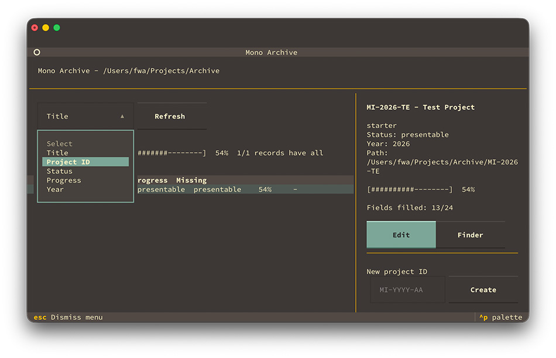

# mono-archive

mono-archive is a tool for creating and maintaining archives of monointerferenz.

It presents a overview of the archive, prepares an record struckture and provides an interface for editing the manifest.yaml.



## Installation

### Requirements

- Python 3.13 or newer
- uv installed

Clone the repository

```bash
git clone <repository-url>
cd mono-archive
```

Setup the environment

Insall the dependencies

```
uv sync --all-extras
```

Install globally

```
uv tool install e.
```

## Usage

```
run python -m mono_archive.main <Archive-directory>
```

